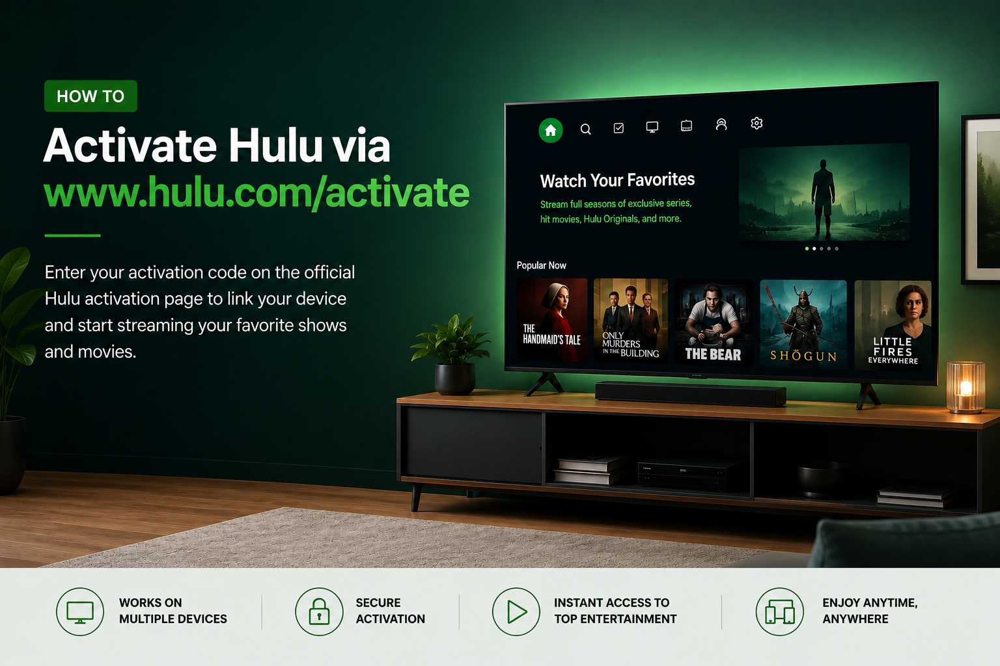

.. raw:: html

   

      
   

Activating Hulu on a Smart TV, Roku, Fire TV, Apple TV, or gaming console is simple with **www.hulu.com/activate**. To link your device, open the Hulu app, get the activation code shown on your screen, and enter it on the official activation page using a web browser.

Activating Hulu on a Smart TV, Roku, Fire TV, Apple TV, or gaming console is simple with **www.hulu.com/activate**. To link your device, open the Hulu app, get the activation code shown on your screen, and enter it on the official activation page using a web browser. Once the code is verified, your device will connect to your Hulu account, and you can start streaming your favorite shows and movies.

Steps to Activate Hulu
----------------------

Follow these steps to activate Hulu on your streaming device:

#. Open the **Hulu** app on your Smart TV or streaming device.
#. Select **Log In** from the Hulu app menu.
#. Choose the option to activate your device using a computer or web browser.
#. Note down the activation code displayed on your TV screen.
#. Open a browser on your phone or computer.
#. Visit **www.hulu.com/activate**.
#. Sign in with your Hulu account credentials.
#. Enter the activation code shown on your TV.
#. Click **Activate** and wait for your device to refresh.
#. Start watching Hulu content after successful activation.

Troubleshooting Hulu Activation Issues
--------------------------------------

If your Hulu activation is not working, try these solutions:

* Check that the activation code is entered correctly.
* Make sure your streaming device has a stable internet connection.
* Restart the Hulu app and request a new activation code.
* Confirm that your Hulu subscription is active.
* Update the Hulu application to the latest version.
* Restart your TV or streaming device and try again.

Activate Hulu on Different Devices
----------------------------------

You can activate Hulu on multiple supported devices, including:

* Smart TVs
* Roku devices
* Amazon Fire TV
* Apple TV
* Gaming consoles
* Streaming media players

Each device requires the same activation process through **www.hulu.com/activate**.

Forgot Hulu Login Details?
--------------------------

If you cannot sign in during activation:

* Select the password recovery option on the Hulu login page.
* Enter your registered email address.
* Follow the instructions to reset your password.
* Sign in again and complete device activation.

Tips to Keep Hulu Account Secure
--------------------------------

To protect your Hulu account:

* Use a strong and unique password.
* Avoid sharing your account credentials with others.
* Sign out from devices you no longer use.
* Keep the Hulu app updated.
* Monitor connected devices from your account settings.

Frequently Asked Questions
--------------------------

Can I activate Hulu without a computer?
^^^^^^^^^^^^^^^^^^^^^^^^^^^^^^^^^^^^^^^

Yes. You can open **www.hulu.com/activate** on a smartphone browser and enter the activation code.

Why is my Hulu activation code not working?
^^^^^^^^^^^^^^^^^^^^^^^^^^^^^^^^^^^^^^^^^^^

The activation code may have expired. Restart the Hulu app and generate a new code.

Can I activate Hulu on Roku?
^^^^^^^^^^^^^^^^^^^^^^^^^^^^

Yes. Roku users can activate Hulu by opening the app, getting the code, and entering it at **www.hulu.com/activate**.

Conclusion
----------

The **www.hulu.com/activate** page makes it easy to connect Hulu with your Smart TV, Roku, Fire TV, Apple TV, and other streaming devices. By entering your activation code and signing in to your account, you can quickly complete the setup process and enjoy Hulu streaming.
